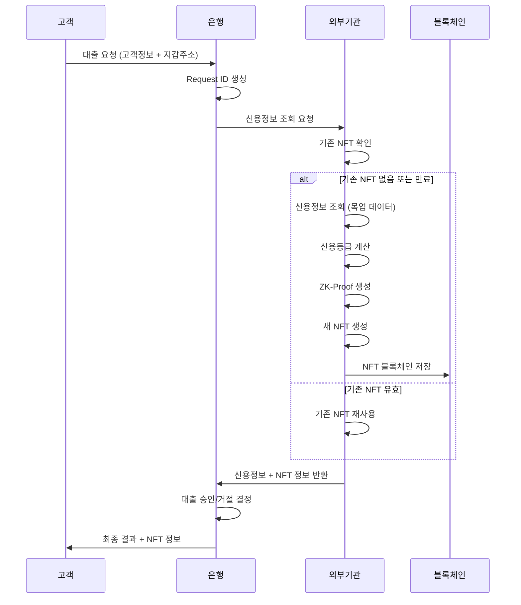
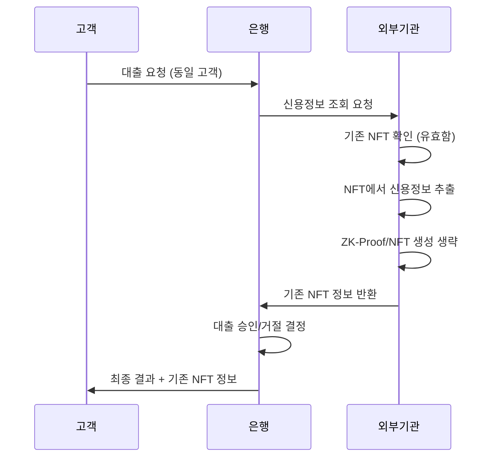
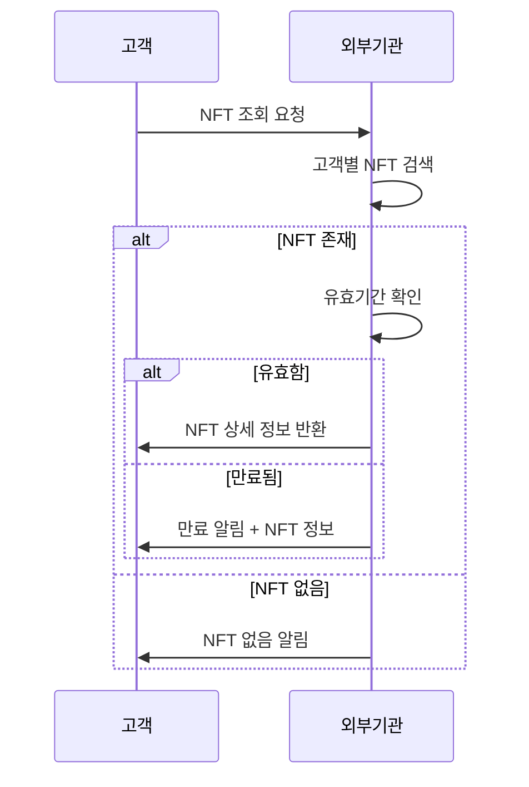

# 🏦 ZK-NFT 신용대출 시스템 전체 개요

## 📋 목차
1. [시스템 개요](#시스템-개요)
2. [아키텍처](#아키텍처)
3. [사용자 플로우](#사용자-플로우)
4. [백엔드 API 구조](#백엔드-api-구조)
5. [목업 데이터](#목업-데이터)
6. [발표 시나리오](#발표-시나리오)
7. [핵심 기능](#핵심-기능)

---

## 🎯 시스템 개요

### **개념**
- **Zero-Knowledge Proof (ZKP)** 기반 신용정보 검증
- **NFT (Non-Fungible Token)** 형태의 신용등급 증명서
- **프라이버시 보존**하면서 신용정보 검증 가능
- **블록체인 기반** 신뢰성 있는 신용정보 관리

### **핵심 가치**
- 🔒 **프라이버시 보호**: 개인 신용정보 노출 없이 검증
- 🏛️ **신뢰성**: 블록체인 기반 불변성
- ⚡ **효율성**: NFT 재사용으로 중복 검증 방지
- 📊 **투명성**: 검증 과정의 투명한 기록

---

## 🏗️ 아키텍처

```
┌─────────────────┐    ┌─────────────────┐    ┌─────────────────┐
│   고객 (Customer) │    │   은행 (Bank)    │    │ 외부기관 (External) │
│                 │    │                 │    │                 │
│ • 대출 요청      │───▶│ • 요청 검증      │───▶│ • 신용정보 조회   │
│ • NFT 조회       │    │ • 외부기관 연동  │    │ • ZK-Proof 생성  │
│ • 결과 확인      │◀───│ • 승인/거절 결정 │◀───│ • NFT 발행       │
└─────────────────┘    └─────────────────┘    └─────────────────┘
                                │                        │
                                ▼                        ▼
                       ┌─────────────────┐    ┌─────────────────┐
                       │   블록체인      │    │   목업 데이터    │
                       │                 │    │                 │
                       │ • NFT 저장      │    │ • 신용정보      │
                       │ • 검증 기록     │    │ • 은행 기준     │
                       └─────────────────┘    └─────────────────┘
```

### **시스템 구성 요소**

#### **1. 고객 (Customer)**
- 대출 요청 및 결과 확인
- NFT 상태 조회
- 블록체인 지갑 연동

#### **2. 은행 (Bank)**
- 대출 요청 접수 및 검증
- 외부기관 신용정보 조회 요청
- 최종 승인/거절 결정
- 고객에게 결과 통보

#### **3. 외부기관 (External Agency)**
- 신용정보 조회 및 등급 산정
- ZK-Proof 생성
- NFT 발행 및 블록체인 저장
- NFT 유효성 관리

#### **4. 블록체인 (Blockchain)**
- NFT 저장 및 관리
- 검증 기록 저장
- 불변성 보장

---

## 🔄 사용자 플로우

### **Phase 1: 대출 요청 및 NFT 생성**



### **Phase 2: NFT 재사용 (유효기간 내)**



### **Phase 3: NFT 조회 및 관리**



---

## 🔌 백엔드 API 구조

### **은행 API (`/api/bank/`)**

#### **1. 대출 요청** `POST /api/bank/loan-request`
```json
{
    "customer_id": "CUST_001",
    "customer_name": "김철수",
    "requested_amount": 15000000,
    "purpose": "사업자금",
    "customer_address": "0x742d35Cc6634C0532925a3b8D4C9db96C4b4d8b6"
}
```

**응답:**
```json
{
    "status": "completed",
    "request_id": "REQ_CUST_001_1753980529",
    "approval_status": "approved",
    "message": "대출이 승인되었습니다. NFT 토큰 ID: NFT_PROOF_INQ_CUST_001_1753980529_1753980529",
    "nft_token_id": "NFT_PROOF_INQ_CUST_001_1753980529_1753980529",
    "credit_grade": "B",
    "max_loan_amount": 50000000,
    "approved_amount": 15000000
}
```

#### **2. NFT 검증** `POST /api/bank/verify-nft`
```json
{
    "token_id": "NFT_PROOF_INQ_CUST_001_1753980529_1753980529",
    "customer_id": "CUST_001"
}
```

### **외부기관 API (`/api/external/`)**

#### **1. 신용정보 조회** `POST /api/external/credit-inquiry`
```json
{
    "customer_id": "CUST_001",
    "customer_name": "김철수",
    "requested_amount": 15000000,
    "purpose": "사업자금",
    "request_id": "REQ_CUST_001_1753980529",
    "customer_address": "0x742d35Cc6634C0532925a3b8D4C9db96C4b4d8b6"
}
```

**응답:**
```json
{
    "inquiry_id": "INQ_CUST_001_1753980529",
    "request_id": "REQ_CUST_001_1753980529",
    "customer_id": "CUST_001",
    "credit_score": 750,
    "credit_grade": "B",
    "max_loan_amount": 50000000,
    "approval_eligible": true,
    "proof_id": "PROOF_INQ_CUST_001_1753980529",
    "token_id": "NFT_PROOF_INQ_CUST_001_1753980529_1753980529",
    "nft_metadata": { ... },
    "blockchain_tx_hash": "0x1234...",
    "status": "completed"
}
```

#### **2. NFT 조회** `POST /api/external/my-nft`
```json
{
    "customer_id": "CUST_001",
    "customer_address": "0x742d35Cc6634C0532925a3b8D4C9db96C4b4d8b6"
}
```

**응답:**
```json
{
    "status": "valid",
    "message": "NFT가 유효합니다.",
    "nft_data": {
        "token_id": "NFT_PROOF_INQ_CUST_001_1753980529_1753980529",
        "name": "Credit Grade B NFT",
        "attributes": [
            {"trait_type": "Credit Grade", "value": "B"},
            {"trait_type": "Max Loan Amount", "value": 50000000},
            {"trait_type": "Issue Date", "value": "2025-08-01T01:48:49.355442"},
            {"trait_type": "Expiry Date", "value": "2025-08-31T01:48:49.355442"}
        ],
        "issue_date": "2025-08-01T01:48:49.355442",
        "expiry_date": "2025-08-31T01:48:49.355442",
        "is_valid": true
    }
}
```

#### **3. ZK-Proof 생성** `POST /api/external/generate-proof`
#### **4. NFT 발행** `POST /api/external/mint-nft`
#### **5. Proof 조회** `GET /api/external/proof/<proof_id>`

### **고객 API (`/api/customer/`)**

#### **1. 대출 신청** `POST /api/customer/apply-loan`
#### **2. 신청 상태 조회** `GET /api/customer/loan-status/<request_id>`
#### **3. 내 NFT 목록** `GET /api/customer/my-nfts`
#### **4. 대출 이력** `GET /api/customer/loan-history`

---

## 📊 목업 데이터

### **1. 신용정보 데이터** (`data/credit_data.json`)
```json
{
    "customers": {
        "CUST_001": {
            "name": "김철수",
            "credit_score": 750,
            "income": 50000000,
            "debt_ratio": 0.3,
            "payment_history": "excellent",
            "employment_status": "full_time",
            "residence_stability": 5
        },
        "CUST_002": {
            "name": "이영희",
            "credit_score": 820,
            "income": 70000000,
            "debt_ratio": 0.2,
            "payment_history": "excellent",
            "employment_status": "full_time",
            "residence_stability": 8
        },
        "CUST_003": {
            "name": "박민수",
            "credit_score": 650,
            "income": 35000000,
            "debt_ratio": 0.5,
            "payment_history": "good",
            "employment_status": "full_time",
            "residence_stability": 3
        }
    }
}
```

### **2. 은행 기준 데이터** (`data/bank_criteria.json`)
```json
{
    "credit_grades": {
        "A": {
            "min_score": 800,
            "max_loan_amount": 100000000,
            "interest_rate": 0.03
        },
        "B": {
            "min_score": 700,
            "max_loan_amount": 50000000,
            "interest_rate": 0.05
        },
        "C": {
            "min_score": 600,
            "max_loan_amount": 20000000,
            "interest_rate": 0.08
        },
        "D": {
            "min_score": 500,
            "max_loan_amount": 5000000,
            "interest_rate": 0.12
        },
        "E": {
            "min_score": 0,
            "max_loan_amount": 0,
            "interest_rate": 0.15
        }
    }
}
```

### **3. NFT 저장소 (메모리)**
```python
nft_storage = {
    "CUST_001_0x742d35Cc6634C0532925a3b8D4C9db96C4b4d8b6": {
        "token_id": "NFT_PROOF_INQ_CUST_001_1753980529_1753980529",
        "name": "Credit Grade B NFT",
        "attributes": [...],
        "issue_date": "2025-08-01T01:48:49.355442",
        "expiry_date": "2025-08-31T01:48:49.355442",
        "is_valid": true
    }
}
```

---

## 🎤 발표 시나리오

### **시나리오 1: 신규 고객 대출 신청**

#### **1. 문제 상황 제시**
```
"기존 대출 시스템의 문제점:
- 개인 신용정보 노출 위험
- 중복 신용조회로 인한 비효율성
- 신용정보 조작 가능성"
```

#### **2. 솔루션 소개**
```
"ZK-NFT 시스템으로 해결:
- Zero-Knowledge Proof로 프라이버시 보호
- NFT 재사용으로 효율성 증대
- 블록체인 기반 불변성 보장"
```

#### **3. 실시간 데모**
1. **대출 요청**: 고객이 대출 신청
2. **신용정보 조회**: 외부기관에서 신용정보 조회 (목업)
3. **ZK-Proof 생성**: 신용정보를 노출하지 않고 증명 생성
4. **NFT 발행**: 블록체인에 NFT 저장
5. **대출 승인**: 은행에서 최종 승인
6. **결과 확인**: 고객이 NFT와 함께 승인 결과 확인

#### **4. 핵심 포인트 강조**
- 🔒 **프라이버시**: 신용정보 노출 없이 검증
- ⚡ **효율성**: NFT 재사용으로 중복 조회 방지
- 🏛️ **신뢰성**: 블록체인 기반 불변성

### **시나리오 2: 기존 고객 재대출**

#### **1. 상황 설정**
```
"1개월 후, 같은 고객이 추가 대출을 요청합니다.
기존 NFT가 아직 유효한 상황을 보여드리겠습니다."
```

#### **2. 효율성 데모**
1. **대출 요청**: 동일 고객 대출 신청
2. **NFT 확인**: 기존 NFT 발견 및 유효성 확인
3. **재사용**: 신용정보 조회 생략, 기존 NFT 재사용
4. **빠른 승인**: 즉시 대출 승인 처리

#### **3. 비교 분석**
```
"기존 시스템: 매번 신용정보 조회 (시간 + 비용)
ZK-NFT 시스템: NFT 재사용 (즉시 처리)"
```

### **시나리오 3: NFT 관리 및 조회**

#### **1. NFT 조회 데모**
```
"고객이 자신의 NFT 상태를 확인할 수 있습니다."
```

#### **2. 유효기간 관리**
```
"NFT는 1개월 유효기간을 가지며,
만료 시 자동으로 새로운 신용정보 조회가 필요합니다."
```

---

## ⚡ 핵심 기능

### **1. Zero-Knowledge Proof**
- 신용정보 노출 없이 신용등급 증명
- 수학적 암호화 기반 검증
- 프라이버시 보호 강화

### **2. NFT 기반 신용증명**
- 블록체인에 저장되는 신용등급 증명서
- 불변성 및 신뢰성 보장
- 재사용 가능한 디지털 자산

### **3. 스마트 재사용 시스템**
- 1개월 유효기간 설정
- 유효기간 내 자동 재사용
- 효율성 및 비용 절감

### **4. 실시간 검증**
- 즉시 신용정보 검증
- 실시간 대출 승인/거절
- 투명한 검증 과정

### **5. 블록체인 기반 보안**
- 분산 저장으로 보안 강화
- 조작 불가능한 기록
- 감사 추적 가능

---

## 🚀 기술 스택

### **Backend**
- **Flask**: Python 웹 프레임워크
- **ZoKrates**: ZK-Proof 생성 도구
- **Web3.py**: 블록체인 연동

### **Frontend (예정)**
- **React/Vue.js**: 사용자 인터페이스
- **Web3.js**: 블록체인 연동
- **Material-UI/Ant Design**: UI 컴포넌트

### **Blockchain**
- **Ethereum**: NFT 저장 및 관리
- **IPFS**: 메타데이터 저장 (예정)

### **Infrastructure**
- **Docker**: 컨테이너화
- **PostgreSQL**: 데이터베이스 (예정)
- **Redis**: 캐싱 (예정)

---

## 📈 향후 발전 방향

### **1. 확장성**
- 다중 은행 지원
- 다양한 신용정보 제공업체 연동
- 국제 표준 준수

### **2. 기능 강화**
- 실시간 신용정보 업데이트
- AI 기반 신용평가
- 크로스체인 호환성

### **3. 사용자 경험**
- 모바일 앱 개발
- 직관적인 UI/UX
- 다국어 지원

---

*이 문서는 ZK-NFT 신용대출 시스템의 전체적인 구조와 플로우를 설명합니다.* 